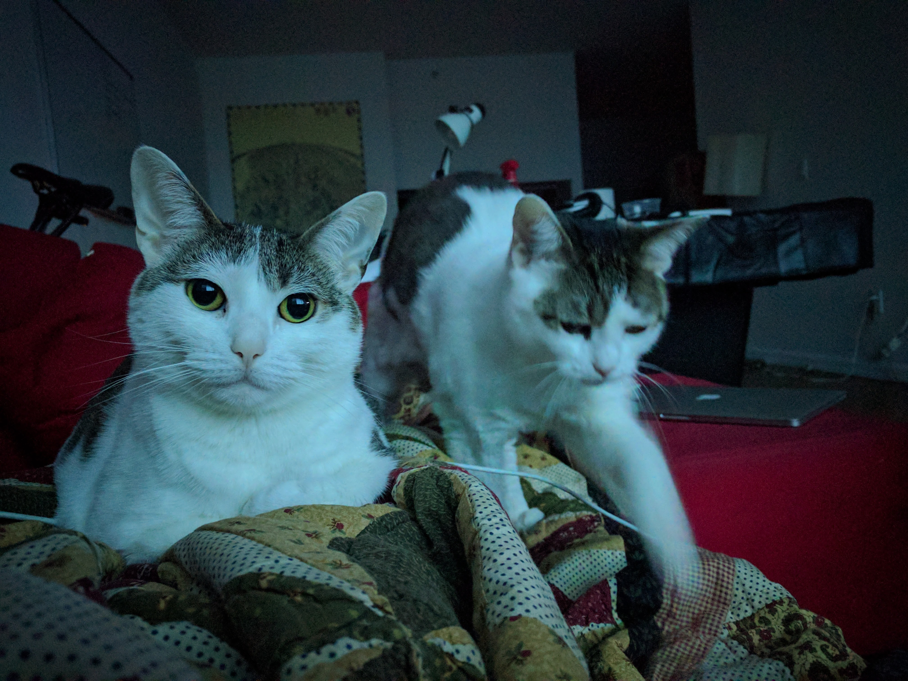
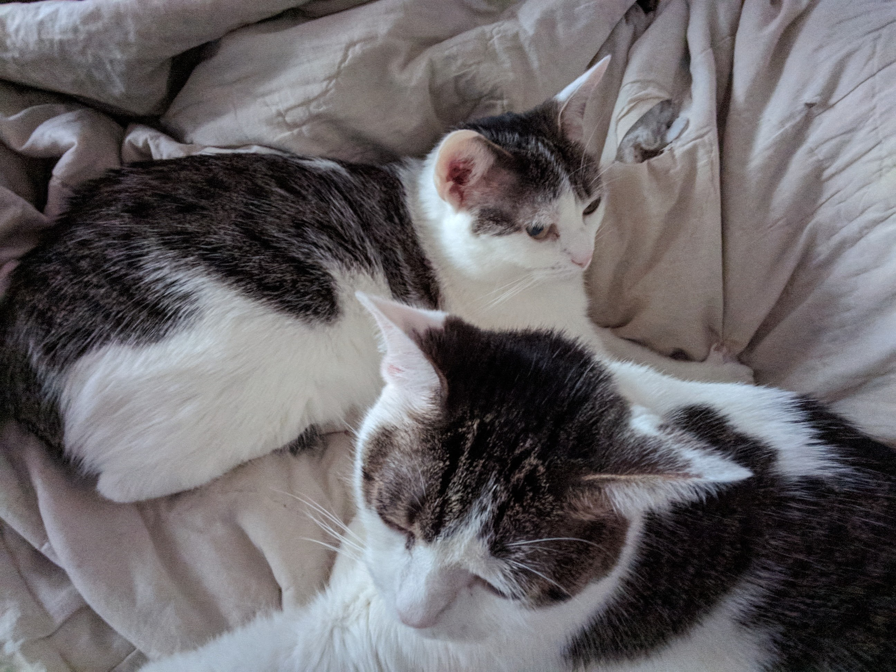

# User Manual
My name is Natasha Dykes, I’m a software engineer with a drive for being the best that I can at what I do. I got the idea to make a user manual from my manager [Carlos Rymer](https://github.com/carlosrymer/manager-README). I think this is a great way to learn about your teams upfront rather than through trial and error. It’s also a good practice in introspection and reflection on your current values and ideals. This is a living document that I will be sure to revisit this (at least annually) as I’m sure some points in here will change as I continue to grow.

## My values.
I get excited about work that is meaningful and impactful to end-users, my team and my engineering peers.  When working in a team I value independence, efficiency, effective collaboration, empowerment to do my work and feeling heard. I subscribe to the mantra of investing in what you believe in, as a result I am happy to push for initiatives that may have upfront costs/growing pains if there are long-lasting benefits for the team and our infrastructure. I’m a believer of progress over politics, to me it’s important to get iterate and find out what works rather than to get trapped in groupthink or inertia. Every team is different, we all have prior experiences that color our approach to our work and how we collaborate, this  provides us all with a great opportunity to learn from one another and improve our work overall.

## My goals.
My top priority at this point in my career is to work on tasks that expand my skill set and allow me to grow as an engineer. Growing as an engineer comes from many things - it’s not limited strictly to coding. Having opportunities to grow when it comes to providing mentorship to others, sharing ideas and building/engaging in a strong engineering team are also skills that I seek when working on a team. My hopes is to contribute to the tech community as much as I gain from it and instill a strong sense of community on the team I’m a part of (despite my introvert inclinations).

## My quirks.
I like working within defined set of rules that are efficient and effective. As much as I value to iterating on processes to find out what works best for the team. I am most comfortable operating within a well-defined (and enforced!) process that help with collaboration, contributions and maintenance. I have found that when a team come to a consensus on how to handle ad-hoc requests/questions, hot-fixes, late feature changes, etc. it allows team-members to complete tasks at hand without getting too derailed. Having a effective processes in place can:
* minimize scope-creeping changes that delay releases 
* minimize the number of interruptions and context switches that kill productivity
* enable bug fixes to be addressed quickly and confidently

I can be very goal oriented which sounds good on paper, however, when I encounter situations that I perceive interrupt that progress it can get to me. In those moments I always try to look at the situation in terms of how this contributes to the team’s goals vs my personal contributions towards the team’s goals. There’s definitely a balance act with managing other commitments while trying to accomplish a goal since too many meetings, various commitments grabbing for attention, and little tangible accomplishments can leave one feeling discouraged and frustrated. It is something that I’m continuing to grow and improve around.

## How to best communicate and work with me.
I’m pretty open to communication in various forms when it comes to brainstorming or receiving feedback. Productivity can be a hot commodity when there are a lot of meetings, slack messages, emails and other notifications/commitments all requesting your attention concurrently. Occasionally I may sign off of Slack/IM platforms to better concentrate on my work, if a request/question is not time-sensitive, my ideal time to communicate is when I’m not actively working on a task, typically right after standup and early afternoon. 

When it comes to tasks or deliverables, I work best with written communication - specifically written communication in the ticket (or whatever task tracking system is being used). I also find it extremely helpful if all details are finalized before the start of sprint, resource and requirement gathering shouldn't happen during the sprint for an implementation task. I come from a QA background and from my experience a lot of the bugs that get to production or delay releases come from inadequate documentation, and/or various parties not completely understanding what a story should accomplish. Otherwise, it can cause frustration, duplicative work, idleness (waiting for requirement details), and detail clarification during the sprint.

 
## How I take feedback. How I give feedback.
I am always interested in feedback whenever it may come up! Constructive feedback can be hard to give but just know that I am never operating with ill-intent, if that is how it was perceived please let me know so that I can be more aware moving forward, a quick note or one-on-one’s are always welcomed.  I’m most comfortable giving feedback, in written form either via email, shared docs or kudos during retro.

## My Interests.
I am the human companion to two beautiful feline babes.

I like to travel and the more I travel the more I’m convinced that turbulence will be the cause of my demise. 

I’m an avid board gamer, I’m always looking for opportunities to plan a board game night.

I like finding new ways of improving myself, whether that’s with organizing my apartment, meal prepping for the week, or learning new technology with a side project I like to use my spare time to improve and optimize my time and quality of life.